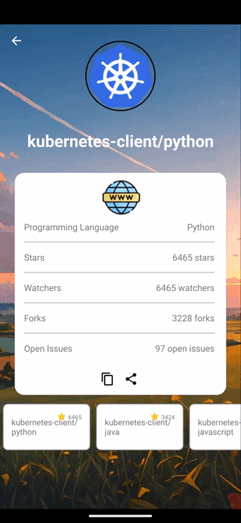
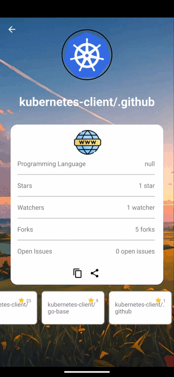
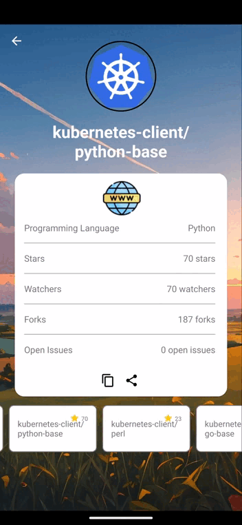

# 株式会社ゆめみ Android エンジニアコードチェック課題
# REPOくん - リポジトリを検索できるアプリ

REPOくんはGitHubのリポジトリを検索し、詳細情報を閲覧できるAndroidアプリです。直感的なUIと豊富な機能で、ユーザーが求めるリポジトリを簡単に見つけることができます。

## アプリの操作流れは下記の通りです。

本アプリは GitHub のリポジトリを検索するアプリです。
 1.Splash画面&nbsp;2. Search画面&nbsp;3. ローデイング画面 
    

 4.Background変更&nbsp;5. 検索結果画面&nbsp;6. 検索結果が0件の場合の画面 
    

 7.#コード許可なしエラーメッセージ&nbsp;8. 検索結果詳細画面&nbsp;9. ユーザーの他のリポジトリ情報表示 
    

 10.URLをクリップボードにコピーする機能&nbsp;11. URLを他のアプリで共有する機能&nbsp;12. リポジトリをブラウザで直接開く機能 
     

### 環境は下記の通りです

- IDE：Android Studio Iguana | 2023.2.1 Patch 2
- Kotlin：1.6.21
- Java：17.0.11
- Gradle：8.4
- minSdk：23
- targetSdk：33

### 最近のアップデート

アプリは以下のPull Requestを通じて、様々な改善と新機能が追加されました。

- [ソースコードの可読性の向上 #1](https://github.com/asithishantha/android-engineer-codecheck-asith/pull/10)
- [安全性向上のためのコード改善 #2](https://github.com/asithishantha/android-engineer-codecheck-asith/pull/11)
- [バグを修正 #3](https://github.com/asithishantha/android-engineer-codecheck-asith/pull/13)
- [Fat Fragmentの解消とMVVMアーキテクチャへの全面移行 #4](https://github.com/asithishantha/android-engineer-codecheck-asith/pull/14)
- [プログラム構造をリファクタリング #5](https://github.com/asithishantha/android-engineer-codecheck-asith/pull/16)
- [テストを追加 #7](https://github.com/asithishantha/android-engineer-codecheck-asith/pull/18)
- [UIをブラッシュアップし新機能を追加 #8](https://github.com/asithishantha/android-engineer-codecheck-asith/pull/19)

これらの変更により、アプリの安定性、ユーザーエクスペリエンス、および開発者の作業効率が向上しました。特に、MVVMアーキテクチャへの移行により、コードの保守性とテスト容易性が大幅に改善されています。

### 今後の予定

#### ステップ2のリリースに向けてmainからdev-step2ブランチ切って、以下の改善を行ってます。

- 単体テストとUIテストの更新：品質保証を強化し、安定したアプリの提供を目指します。
- 画面回転対応：デバイスの回転に柔軟に対応し、ユーザビリティを高めます。
- ダークモード対応：ユーザーのシステム設定に合わせたダークモード表示を実現します。
- テストの自動化：CI/CDパイプラインを通じて、ビルドとテストのプロセスを自動化し、迅速かつ確実なリリースサイクルを実現することを目指しています。
- ProGuard設定の改善：リリースビルドの難読化を強化し、セキュリティを向上させるためにProGuardのルールを見直し、更新します。

#### ステップ3のリリースでは、アプリに以下の新機能を導入することを目指しています。

- Roomデータベースの導入：効率的なデータ管理とオフライン機能の向上を目指し、Roomデータベースを利用したデータ永続化を実装します。
- ログイン機能とユーザー登録機能の追加：よりセキュアなユーザー体験を提供するために、認証機能を強化します。
- Jetpack Composeの採用：最新のUI開発フレームワークを使用して、アプリのUIを再構築し、よりモダンでレスポンシブなデザインを実現します。

- これらの取り組みにより、REPOくんはより使いやすく、信頼性の高いアプリへと進化を遂げることでしょう。ユーザーの皆様には、今後のアップデートを楽しみにしていただければ幸いです。

---