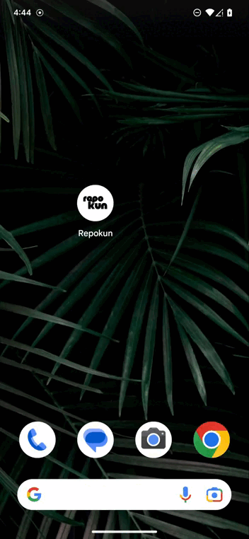

# 株式会社ゆめみ Android エンジニアコードチェック課題

## 概要

本プロジェクトは株式会社ゆめみ（以下弊社）が、弊社に Android エンジニアを希望する方に出す課題のベースプロジェクトです。本課題が与えられた方は、下記の概要を詳しく読んだ上で課題を取り組んでください。

## アプリ仕様

本アプリは GitHub のリポジトリを検索するアプリです。

※ ライブラリの利用はオープンソースのものに限ります。
※ 環境は適宜更新してください。

  

### 環境

- IDE：Android Studio Flamingo | 2022.2.1 Patch 2
- Kotlin：1.6.21
- Java：17
- Gradle：8.0
- minSdk：23
- targetSdk：31
